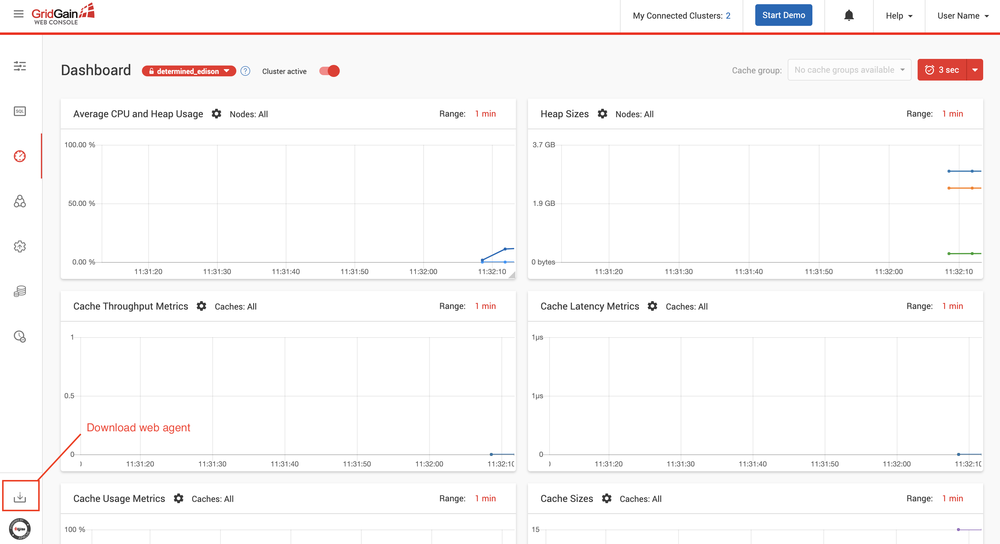

# Changes Replication Between GridGain Clusters With Kafka Connector

The demo shows how to use Apache Kafka to replicate changes between two separate GridGain clusters with architecture and 
configuration process covered on this documentation page: https://www.gridgain.com/docs/latest/integrations/kafka/kc-ex-replication.

This is a ready to be used project that bootstraps GridGain and Kafka Connect clusters with GridGain WebConsole in Docker.
Just follow the instructions below to get the demo working.

## Prerequisites

Install Docker if it's installed in your environment yet: https://www.docker.com/get-started

## Start GridGain, Kafka and WebConsole in Docker

Clone or download this repository and start the demo by running `start.sh` from the root of the project.

The script pulls and builds the images as well as deploys the following containers:

* Two single-node GridGain clusters (`gridgain-source-node` is the container of the first cluster while
 `gridgain-sink-node` belongs to the second cluster).
* Two WebConsole containers - `gridgain-webconsole-backend` and `gridgain-webconsole-frontend`.
* One Kafka container named `gridgain-kafka` with pre-configured source and sink connectors.

## Start Web Agent to Monitor GridGain Clusters

Once WebConsole started, you will need to download the web agent and connect it with the clusters. Open the following
address in your browser: http://localhost/

Download the agent using the button in the bottom left corner of the screen:

Open a terminal window, navigate to the web agent root folder and execute the following command that will connect the
agent with the first cluster:

`./web-console-agent.sh --server-uri http://localhost --node-uri http://localhost:6081`
 
Open another terminal tab and connect to the second cluster using the following parameters:

`./web-console-agent.sh --server-uri http://localhost --node-uri http://localhost:6082`

More information about WebAgent configuration can be found on the following documentation page:
https://www.gridgain.com/docs/web-console/latest/web-agent-configuration

## Load Data

The Source cluster can be found by checking the name of the nodes on WebConsole's monitoring screen:

Check the image below for how to locate the clusters switch button:

Open to SQL notebooks of the Source cluster, create a new one and execute all the SQL statements from `insert_data.sql` of
this GitHub project:

Go back to the monitoring screen and check the caches are no longer empty.

## Check That Changes Were Replicated

Switch to the second cluster (the Sink cluster) to confirm that all the changes inserted into the Source cluster were
replicated via Kafka Connector:

## Stop Demo

Run `stop.sh` script from the project root to stop all the containers.
